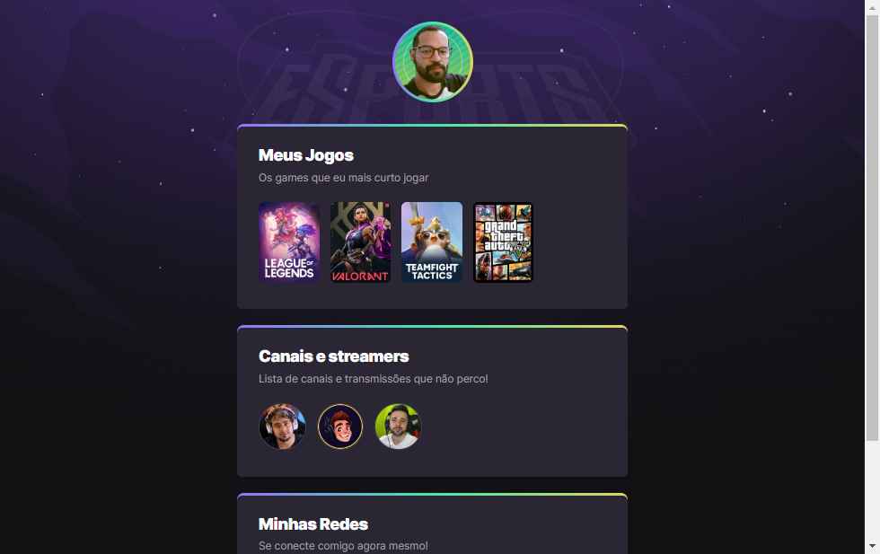

# NLW eSports

> Trilha Explorer

Projeto construído do evento Next Level Week da Rocketseat.

[🔗 Clique aqui para acessar](https://phaeldev.github.io/nlw-esports-explorer/)

## 🛠️ Tecnologias

- HTML
- CSS
- Git e Github

## 💡 O que aprendi 💡

Participar desse projeto da Rocketseat foi muito gratificante pra mim, pois abriu minha mente pras tecnologias que posso aprender. Com o projeto eu aprendi a mexer com o Git/Github com o qual eu sempre tive bastante dificuldade de manusear, e entendi muito conteito de CSS a mexer com o design e até a animação de transição no site.

## 📫 Contato

✉️ raphaelsouza.dev@gmail.com 
